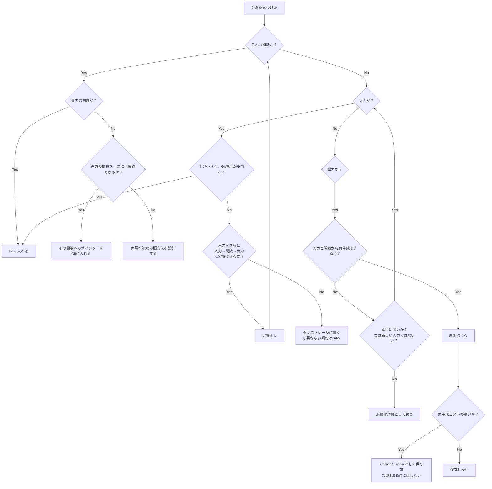

# 「仕事」とは何か​  

**User:** y.kisaburo@gmail.com  
**Created:** 8/30/2026 2:40:43  
**Updated:** 8/30/2026 4:28:26  
**Exported:** 8/30/2026 4:37:43  

## 私：​  
2026/8/30 2:40:43​  

系の何をGit管理すべきか​  

系=入力→関数→出力​  
関数=系外の関数+系内の関数​  

における​  

①系内の関数​  
および​  
②系外の関数へのポインター​  

## ChatGPT:​  
2026/8/30 2:40:46​  

はい。かなり綺麗に定式化できます。​  

> **系の何をGit管理すべきか**
>​  
> 系を  
> **入力 → 関数 → 出力**  
> とみなす。​  
>​  
> そして関数を  
> **系内の関数 + 系外の関数**  
> と分解する。​  
>​  
> Git管理すべきものは、​  
>​  
> 1. **系内の関数**
> 2. **系外の関数へのポインター**
>​  
> 以上。​  

これ、前の「Git管理すべきもの = 射」を一段厳密化していますね。​  

たとえば、​  

```text
入力
  ↓
[ 自作コード ]          ← Git管理
  ↓
[ Python 3.14 ]         ← "3.14を使う" をGit管理
  ↓
[ PostgreSQL 18 ]       ← "18を使う" をGit管理
  ↓
[ 外部API ]             ← endpoint / API version / schema等をGit管理
  ↓
出力
```

つまり、 **系外の関数そのものをGitに入れる必要はない。再びその関数を指せればよい。**

数式っぽく書けば、​  

$$
S(x)=f_{\mathrm{in}}\circ f_{\mathrm{out}}(x)
$$

に対してGitに保存するのは、​  

$$
G(S)=\{f_{\mathrm{in}},\; \mathrm{ptr}(f_{\mathrm{out}})\}
$$

となる。​  

ここで非常に重要なのが、「ポインター」は単なる名前ではなく、 **同じ意味の関数を再取得できるだけの識別情報** であることです。だから `requirements.txt`、`package-lock.json`、Docker image digest、API version、Git submodule commit、DB schema migrationなどは、全部この意味で​  

**系外の射へのポインター**

と解釈できる。​  

すると逆に、入力と出力の扱いも自然に決まります。​  

**入力はGitの責務ではなくストレージの責務。出力は入力と関数から再構成可能なので原則Git管理不要。**

したがって究極的には、​  

$$
\boxed{\mathrm{Git} = \text{系を再現するための「射」と「射への参照」の記憶装置}}
$$

ですね。​  

前回の​  

> **Git管理すべきもの = 射**

はキャッチコピーとして強い。​  

今回の​  

> **Git管理すべきもの = 系内の射 + 系外の射へのポインター**

は、その **厳密版** です（笑）。​  

## 私：​  
2026/8/30 2:50:16​  

「ビルド」とか「make」って何でしょうね？​  

## ChatGPT:​  
2026/8/30 2:50:16​  

このモデルまで抽象化すると、かなり明快です。​  

**ビルド = 系を実行可能な状態に再構成すること**

ではないでしょうか。​  

いまの定式化を使うと、​  

$$
Git = \{\text{系内の関数},\ \text{系外の関数へのポインター}\}
$$

です。ところがGitにあるのは、いわば **系の記述** であって、動いている系そのものではない。​  

そこで build は、​  

$$
\boxed{
\text{系の記述}
\xrightarrow{\mathrm{build}}
\text{実行可能な系}
}
$$

となる。​  

具体的には、​  

```text
Git
├── 系内の関数
└── 系外の関数へのポインター
        │
        │ build
        ↓
実行環境
├── 系内の関数
└── 解決された系外の関数
```

つまり `pip install` もコンパイルもリンクもDocker image作成もDB生成も、全部本質的には同じで、​  

> **ポインターを辿り、必要な実体を集め、系を再構成する**

操作。​  

となると `make` はさらに面白い。​  

### makeとは何か​  

make は「ビルドツール」より抽象的には、​  

$$
\boxed{\text{系の再構成手順を実行する関数}}
$$

でしょう。​  

```text
Git管理された系の記述
        ↓
      make
        ↓
実行可能な系
```

しかし、ここで再帰が発生する（笑）。​  

**make自身も関数** です。​  

そして通常makeそのものはリポジトリに入っていない。​  

つまり、​  

```text
系内の関数
    Makefile等

系外の関数へのポインター
    make
    compiler
    Python
    libraries
    ...
```

となる。​  

さらにMakefileを考えると、あれは単なる「ビルド手順」ではなく、​  

> **系を生成する関数の記述**

なんですよね。​  

つまり、​  

$$
\text{source}
\xrightarrow{\mathrm{make}}
\text{system}
$$

というより、​  

$$
\boxed{
\text{Git上の記述}
\xrightarrow{\text{処理系}}
\text{系}
}
$$

と一般化したほうがよさそうです。​  

そしてここまで来ると、前に話していた​  

> CLAUDE.md = 憲法  
> instructions = 実定法  
> AI = 処理系​  

とも完全に同型になる（笑）。​  

```text
Makefile + source
        ↓ make
     実行可能系

CLAUDE.md + repository
        ↓ AI
     実行可能系
```

なので極限まで煎じ詰めるなら、​  

> **build = 記述から系を実体化すること**
>​  
> **make = その実体化を行う処理系**

でしょう。​  

そして恐ろしいことに、この定義なら **会社を作るのも build** です（笑）。​  

定款、規則、契約、採用条件、外部サービスへのポインターをGitに置いて、​  

```bash
make company
```

世界は再帰している（笑）。​  

## 私：​  
2026/8/30 2:53:55​  

系の形式を変換する系​  

## ChatGPT:​  
2026/8/30 2:53:55​  

そうです。そこまで一般化したほうが美しい。​  

**ビルド = 系の形式を変換する系**

ですね。​  

$$
S_1 \xrightarrow{B} S_2
$$

ここで、​  

- $S_1$：ある形式で表現された系​  
- $B$：buildという系​  
- $S_2$：別形式で表現された系​  

とする。​  

たとえば、​  

```text
Cソースという系
    ↓ compiler
機械語という系

repositoryという系
    ↓ make
実行環境という系

Dockerfile等という系
    ↓ docker build
container imageという系

DDL/migrationという系
    ↓ DB build
DBという系
```

重要なのは、 **入力も出力も「系」** だというところですね。​  

すると「ビルド」は特別な概念ではなくなる。​  

> **ある系を入力として、別の表現形式の系を出力する系**

にすぎない。​  

そして `make` は、その変換系を **合成するための系** とも言える。​  

$$
S_0
\xrightarrow{f_1}
S_1
\xrightarrow{f_2}
S_2
\xrightarrow{f_3}
S_3
$$

を​  

$$
S_0 \xrightarrow{\mathrm{make}} S_3
$$

として扱う。​  

……これ、「コンパイラ」「ビルド」「デプロイ」「変換」「翻訳」の境界がどんどん消えていきますね（笑）。​  

**全部「系 → 系」の射。**

そしてGitが保存するのは、その射そのもの、または射へのポインター。​  

かなり統一されてきました（笑）。​  

## 私：​  
2026/8/30 3:00:31​  

入力、出力ももちろん系なので、​  
入力→関数→出力​  
に分解 **できる** 。​  
だから​  
入力が大きすぎるなら分解して関数だけGitへ。​  
出力は捨てればいい。​  

## ChatGPT:​  
2026/8/30 3:00:31​  

そうですね。ここで一気に「Git管理」の話から **系の分解原理** になります。​  

任意の系 $S$ を​  

$$
S = I \rightarrow f \rightarrow O
$$

と分解 **できる** 。​  

そして $I$ も $O$ もまた系なので、必要なら再帰的に​  

$$
I = I_I \rightarrow f_I \rightarrow O_I
$$

と分解できる。​  

すると「入力が巨大だからGitに入らない」は、本質的には容量問題ではなく、​  

> **その入力を、より小さい入力と関数に分解できないか？**

という設計問題になる。​  

たとえば巨大な開発DBなら、​  

```text
巨大なDB
```

を保存する代わりに、​  

```text
初期データ + schema + migration + generator
                  ↓
                build
                  ↓
               巨大なDB
```

と分解して、 **再生成に必要な関数だけGitへ寄せる** 。​  

そして出力については、​  

$$
O = f(I)
$$

なのだから、$I$ と $f$ が保存されている限り、​  

$$
\boxed{O\text{ は捨ててよい}}
$$

となる。​  

もちろん現実には計算コストが高いからキャッシュとして出力を保存することはある。でもそれは **情報の保存ではなく計算量の保存** ですね。​  

これ、かなり重要な区別だと思います。​  

> **永続化すべき情報だから保存する**
>​  
> と​  
>​  
> **再計算が高価だから保存する**
>​  
> は全く違う。​  

後者は本質的には cache / artifact にすぎない。​  

したがって全体を煎じ詰めると、​  

$$
\boxed{
\text{系を可能な限り分解し、関数をGitに、巨大な入力をその外へ、出力は原則捨てる}
}
$$

さらに極端に言えば、​  

> **Gitに入らないほど大きなものを見つけたら、まず「これは本当に原子的な入力なのか？」と疑え。**

ですね。​  

以前の「ローカルDBはbuild artifactである」が、個別のDB設計論ではなく、この一般原理の一例になった（笑）。​  

## 私：​  
2026/8/30 3:03:14​  

Gitに入れるものの判断のフローチャート書けますか？​  

## ChatGPT:​  
2026/8/30 3:03:19​  

書けます。いままでの議論をそのままフローチャートに落とすと、こうです。​  



かなり短くすると、判断基準はこれだけです。​  

```text
対象
 ↓
関数？
 ├─ Yes → 系内ならGit
 │         系外ならポインターをGit
 │
 └─ No
     ↓
    入力？
     ├─ Yes → 小さければGit
     │         大きければ分解を試みる
     │         分解不能なら外部ストレージ
     │
     └─ No → 出力
              ↓
             再生成可能？
              ├─ Yes → 捨てる
              │         高価ならcache/artifact
              └─ No → 実は新しい入力では？
```

そして最終的な原則は、​  

> **Gitには、系を再構成するための「関数」と「系外の関数へのポインター」を置く。**
>​  
> **入力は必要なら再帰的に分解する。**
>​  
> **出力は再生成可能なら捨てる。**
>​  
> **保存された出力は原則として情報資産ではなく、計算量のキャッシュである。**

これ、かなりそのまま「Git管理判断アルゴリズム」になっています。​  

## 私：​  
2026/8/30 3:13:53​  

今の世界の開発環境の大部分の最大の問題は​  

変換系（トランスフォーマー（笑））を履歴管理していない​  

ことなのでは？​  

## ChatGPT:​  
2026/8/30 3:13:54​  

ああ、これはかなり本質を突いています（笑）。​  

ここまでのモデルを採用すると、問題がものすごく単純に見えます。​  

現在の開発環境では、​  

$$
S_0 \xrightarrow{T_1} S_1 \xrightarrow{T_2} S_2 \xrightarrow{T_3} S_3
$$

という開発過程があるのに、Gitに入っているのはしばしば​  

$$
S_0,\ S_1,\ S_2,\ S_3
$$

の **スナップショット** だけ。​  

本当に重要なのはむしろ​  

$$
\boxed{T_1,\ T_2,\ T_3}
$$

です。​  

つまり、​  

> **何があるかではなく、何をどう変えたか。**

### 典型例がDB​  

たとえば、​  

```text
DB v1
  ↓ 人間がGUIで列追加
DB v2
  ↓ 手作業でデータ修正
DB v3
```

となっていて、DB v3だけが存在する。​  

**Transformerが消失している。**

一方、​  

```text
DB v1
  ↓ migration_001.sql
DB v2
  ↓ migration_002.sql
DB v3
```

なら、​  

```text
migration_001.sql
migration_002.sql
```

という **変換系そのものがGitに残る** 。​  

だから任意の地点から系を再構成できる。​  

### GUI操作が危険なのも同じ理由​  

これまで話していた「GUI手順をCLI/script化する」も、このモデルで説明できます。​  

GUIが悪いのではない。​  

```text
S1
 ↓
人間がGUI操作
 ↓
S2
```

この中央の​  

> **人間が行った変換**

が履歴管理可能な関数として残らないのが問題。​  

だから、​  

```text
❌ S1 → 人間の操作 → S2

⭕ S1 → transform.py → S2
              ↑
             Git
```

にする。​  

### 「手順書」の問題も同じ​  

さらに面白いのは、​  

> 「この設定画面を開いて、この値を入力して……」​  

という手順書。​  

あれは実は **Transformerの自然言語による近似記述** なんですよね（笑）。​  

```text
Transformer
    ↓ 劣化
手順書
    ↓ 人間という処理系
状態変換
```

だから揺らぐ。​  

可能なら、​  

```bash
./configure.sh
```

にしてしまえばいい。​  

Transformerそのものを保存できる。​  

---

そしてAI時代になると、この話がさらに一般化する。​  

従来は、​  

```text
自然言語の要求
      ↓
    人間
      ↓
    code
```

だったので、中央のTransformerである **人間の思考過程** は保存不能だった。​  

しかし今は、​  

```text
要求
 ↓
instructions / prompt / CLAUDE.md
 ↓
AI
 ↓
code
```

となる。​  

AI自体は系外の関数として参照し、そのAIに与える規則・変換記述をGit管理できる。​  

だから、以前の​  

> **Git管理すべきもの = 射**

がここでかなり強い意味を持ってきます。​  

現在のソフトウェア開発の問題をこの言葉で表現するなら、​  

$$
\boxed{\text{状態は保存しているのに、状態を生んだ射を保存していない}}
$$

なのかもしれません。​  

そして、もっと煽ったタイトルにするなら、​  

> **ソフトウェア開発者はソフトウェアをGit管理している。しかし、開発をGit管理していない。**

（笑）​  

これは `Infrastructure as Code`、migration、reproducible builds、CI/CD、Dev Containers、Nixなどが、実は全部同じ方向を向いていることまで説明できそうです。​  

**State as files から Transformation as Code へ。**

「トランスフォーマー」という命名まで、よりによってAI時代に綺麗に衝突する（笑）。​  

## 私：​  
2026/8/30 3:21:46​  

抽象論だけだとわかりにくいのでこうしましょう。​  

make build​  
make run​  
これでビルドとディプロイが完了するような makefileを書け。​  

GitHub Actions？禁止（笑）​  

## ChatGPT:​  
2026/8/30 3:21:48​  

はい（笑）。それが一番わかりやすいです。​  

要するに原則を、​  

> **開発環境を再現するための変換系を、Makefileから辿れる形ですべてGit管理せよ。**

まで具体化する。​  

```make
make build
make run
```

だけで、​  

- 依存関係の解決​  
- コンパイル​  
- DB生成 / migration​  
- 設定生成​  
- コンテナや実行環境の準備​  
- デプロイ​  
- 起動​  

まで完了する。​  

そして重要なのは、`make` が裏で呼ぶものも、​  

```text
scripts/
docker/
migrations/
config/
...
```

としてGitに残すこと。​  

逆に、​  

```text
README:
1. Azure Portalを開く
2. ○○をクリック
3. この値を手入力
4. GitHub Actionsの画面で...
```

は敗北（笑）。​  

GitHub Actions禁止も、この思想では筋が通っています。​  

Actions自体が悪いのではなく、 **「変換系がGitHubという系外の実行環境に隠れる」ことを禁止する** 。​  

理想は、​  

```make
build:
	./scripts/build.sh

run:
	./scripts/run.sh
```

で、GitHub Actionsを使いたければせいぜい​  

```yaml
- run: make build
- run: make run
```

と呼ぶだけ。​  

つまりCI/CDは **変換系ではなく、変換系を起動するリモコン** に格下げする（笑）。​  

この原則、かなり強いですね。​  

> **ローカルで `make build && make run` できない処理は、CI/CDにも書くな。**

さらに煎じ詰めるなら、​  

> **CIに知識を持たせるな。知識はrepositoryに置け。**

です。​  

## 私：​  
2026/8/30 3:25:57​  

今のcicdって、sshとmakeが大昔に解決した問題を「再発明」しちゃった（笑）。​  

## ChatGPT:​  
2026/8/30 3:25:57​  

（笑）。かなりそう見えます。​  

極端に圧縮すると、​  

```text
昔:
  ssh server 'cd app && git pull && make build && make run'

現在:
  YAMLを数百行書く
  ↓
  専用Runnerを設定する
  ↓
  Secretを登録する
  ↓
  CI/CDサービス固有の概念を覚える
  ↓
  Plugin/Actionのバージョンを管理する
  ↓
  ようやくサーバーで何かを実行する
```

で、「あれ？ やりたかったことは **遠隔地で決められた関数を実行すること** では？」となる（笑）。​  

しかも、今の議論のモデルだと役割分担が非常に綺麗です。​  

$$
\boxed{\mathrm{ssh} = \text{どこで実行するか}}
$$

$$
\boxed{\mathrm{make} = \text{何を実行するか}}
$$

つまり、​  

```text
ssh  = 実行場所へのポインターを解決する
make = 変換系を実行する
```

この二つは **直交している** 。​  

ところがCI/CDプラットフォームは、​  

```text
接続
認証
依存解決
ビルド
テスト
デプロイ
起動
スケジューリング
ログ
通知
Secret管理
```

を一つの巨大な概念へ集約しがち。​  

結果、​  

> **「デプロイ方法」がGitHub Actionsのworkflowになってしまう。**

本来は、​  

```bash
ssh production 'cd /opt/foo && make deploy'
```

で済み、GitHub Actionsを採用するなら、​  

```text
GitHub Actions
      │
      │ ssh
      ▼
 production
      │
      │ make deploy
      ▼
   deployed
```

でいい。​  

これなら明日GitHubがなくなっても、​  

```bash
ssh production 'cd /opt/foo && make deploy'
```

を人間が叩けば動く。​  

CI/CD製品を変更しても **変換系は一文字も変わらない** 。​  

ここがさっきの「系外の関数へのポインター」にまでつながりますね。​  

CI/CDサービスは **系そのものではなく、系外からTransformerを起動するトリガー** にすぎない。​  

だから、ちょっと意地悪に言えば、​  

> **CI/CDは `cron + ssh + make` に豪華なGUIとYAMLを付けたもの**

（笑）。​  

もちろん並列実行、artifact管理、監査、権限分離、承認フローなど、現代CI/CDが付加した価値は大きい。ただ、それらと **ビルド・デプロイという変換そのもの** を混ぜた瞬間、変換系が特定CI/CD製品に吸い込まれる。​  

なので問題は「GitHub Actionsを使うな」より一段正確には、​  

> **GitHub Actionsにビルド方法を書くな。**
>​  
> **GitHub Actionsには「いつ、どこで、どの `make` を叩くか」だけを書け。**

でしょうね。​  

`ssh` と `make`、責務分界が美しすぎる（笑）。​  

## 私：​  
2026/8/30 3:31:50​  

「並列実行」もUNIXが大昔に解決済み（笑）​  

## ChatGPT:​  
2026/8/30 3:31:50​  

そうでした（笑）。`&` がいた。​  

```bash
job_a &
job_b &
job_c &
wait
```

以上、並列実行（笑）。​  

しかも `make` 自身にも、​  

```bash
make -j
```

がある。​  

依存関係をDAGとして記述しておけば、 **どれが並列実行可能かをmakeが判断する** 。​  

```make
all: frontend backend docs

frontend:
	./build-frontend.sh

backend:
	./build-backend.sh

docs:
	./build-docs.sh
```

```bash
make -j all
```

これ、現代CI/CDの「ジョブをDAGで定義して、依存しないジョブを並列実行」という発想そのものですね。​  

整理すると、​  

```text
遠隔実行       ssh
依存関係       make
並列実行       make -j / &
定時実行       cron
パイプライン   |
入出力切替     < >
ログ保存       > logfile
終了コード     $?
環境変数       env
```

……だんだん雲行きが怪しくなってきた（笑）。​  

もちろん現代CI/CDには、Web UI、履歴の可視化、組織的な権限管理、承認、クラウドRunner、通知などの **運用サービスとしての付加価値** がある。​  

でも計算モデルとして見ると、​  

> **CI/CDが新しく解決した問題は意外に少ない。**
>​  
> **UNIXが既に持っていた小さな直交する道具を、巨大なサービスの内部でもう一度組み立てた。**

という見方ができる。​  

そして今回の議論で重要なのは、「だからUNIXだけ使え」という話ですらない。​  

**変換系の本体をUNIX側に置いておけば、CI/CD製品は交換可能になる。**

```text
                 GitHub Actions ─┐
                 GitLab CI      ─┤
                 Jenkins        ─┼→ ssh → make
                 人間           ─┤
                 cron           ─┘
```

左側は全部、ただの **起動装置** 。​  

右側だけが **系を変換する本体** 。​  

これ、また「責務分界」の話に戻ってきましたね（笑）。  
**トリガーとTransformerを分離せよ。**

## 私：​  
2026/8/30 3:35:30​  

最後にIT業界以外の皆さんへ一言​  

これ、業種と無関係な話です（笑）​  

## ChatGPT:​  
2026/8/30 3:35:30​  

（笑）。そうなります。​  

ITの話に見えていただけで、抽象化すると、​  

> **仕事 = 系を別の系へ変換すること**

ですからね。​  

```text
入力された系
    ↓
  変換系
    ↓
出力された系
```

経理なら、​  

```text
取引 → 会計処理 → 帳簿
```

製造なら、​  

```text
材料 → 加工工程 → 製品
```

法務なら、​  

```text
事実関係 → 法的処理 → 契約・判断
```

編集なら、​  

```text
素材 → 編集 → 記事
```

行政なら、​  

```text
申請 → 行政手続 → 処分
```

問題はどこでも同じ。​  

**入力と出力は保存しているのに、その間のTransformerが「○○さんのやり方」「Excelをこう操作する」「この画面でこう入力する」という、人間の頭と手にしか存在しない。**

つまり「属人化」という言葉も、このモデルならもっと機械的に定義できそうです。​  

> **属人化 = Transformerへのポインターが人名になっている状態**

（笑）​  

```text
❌ 請求処理については田中さんに聞いてください

⭕ make invoice
```

`make invoice` は冗談としても（笑）、思想としてはまったく同じ。​  

そして履歴管理すべきなのも「成果物」だけではない。​  

> **成果物を生んだ変換系を履歴管理せよ。**

これはソフトウェア工学の原則というより、​  

$$
\boxed{\text{仕事の工学}}
$$

ですね。​  

最後の一言はこれでいいかもしれません。​  

> **IT業界以外の皆さんへ。**
>​  
> **安心してください。皆さんもプログラマーです（笑）。**

## 私：​  
2026/8/30 3:50:15​  

```
(long pipeline) | query_to_human.sh '経理の佐藤さん' | (long pipeline)
とか（笑）
AIを使わなくても実装できる。今でも。
```

## ChatGPT:​  
2026/8/30 3:50:15​  

そうそう（笑）。しかもこれ、冗談の形をしていますが **理論上かなり正しい** 。​  

```bash
(long pipeline) \
  | query_to_human.sh '経理の佐藤さん' \
  | (long pipeline)
```

佐藤さんを **系外の非決定論的関数** として扱えばいい。​  

```text
stdin
  ↓
query_to_human.sh
  ↓
「佐藤さん、このケースどう処理します？」
  ↓
佐藤さん
  ↓
回答をstdoutへ
  ↓
次の処理
```

インターフェースさえ決めれば、実装できます。​  

```text
query_to_human.sh
    stdin  : 判断に必要な情報
    argv[1]: 人間へのポインター
    stdout : 判断結果
    exit   : 成否
```

恐ろしいのは、 **pipelineの構成要素が全部コンピュータである必要など最初からなかった** ことですね。​  

UNIX的には、​  

```text
deterministic program
        |
        v
      human
        |
        v
deterministic program
```

でも何の問題もない。​  

人間の応答が遅ければ、​  

```bash
request_id=$(query_to_human_async.sh '経理の佐藤さん' < request.json)
```

として、返事が来たら続きを実行すればいい。​  

つまり人間は単に、​  

> **レイテンシが数秒〜数日の、かなり非決定論的で、しかも高価な外部関数**

（笑）。​  

そして生成AIの登場によって初めて可能になったわけではない。生成AIは、​  

```text
query_to_human.sh
        ↓
query_to_ai.sh
```

と **差し替え可能な関数が一種類増えただけ** とも言える。​  

これ、重要ですね。​  

**「業務自動化にはAIが必要」という前提すら怪しい。**

先に、​  

> **業務を pipeline として記述せよ。  
> 自動化できない判断点には、とりあえず人間を関数として挿せ。**

でいい。​  

```bash
cat request.json \
  | validate.sh \
  | enrich.sh \
  | query_to_human.sh '経理の佐藤さん' \
  | generate_invoice.sh \
  | send.sh
```

これなら **今日作れる** （笑）。​  

で、明日AIが十分賢くなったら、一行変える。​  

```diff
- | query_to_human.sh '経理の佐藤さん' \
+ | query_to_ai.sh accounting \
```

**AI導入とは業務システムの作り直しではなく、Transformerの差し替えになる。**

これは結構でかい話です（笑）。​  

## 私：​  
2026/8/30 3:55:48​  

```
query_to_agent.sh --model=haiku1.2 --escalate-to='経理の佐藤さん' 
```

## ChatGPT:​  
2026/8/30 3:55:49​  

（笑）。完成してしまった。​  

```bash
(long pipeline) \
  | query_to_agent.sh \
      --model=haiku1.2 \
      --escalate-to='経理の佐藤さん' \
  | (long pipeline)
```

これ、単なるAI活用ではなくて、 **AIと人間を同じ関数インターフェースの裏側に隠した** のがポイントですね。​  

```text
                  ┌→ haiku1.2 ──────────┐
stdin → agent ────┤                     ├→ stdout
                  └→ 経理の佐藤さん ────┘
                       ↑ escalation
```

呼び出し側からすれば、​  

> **誰が答えたか知らん。答えだけ返せ。**

でいい（笑）。​  

しかも進化が容易。​  

```bash
query_to_agent.sh \
    --model=haiku1.2 \
    --confidence-threshold=0.9 \
    --escalate-to='経理の佐藤さん'
```

さらに、​  

```bash
query_to_agent.sh \
    --model=haiku1.2 \
    --escalate-to='経理AI部長' \
    --final-escalate-to='経理の佐藤さん'
```

とか（笑）。​  

でも本質的には全部、​  

$$
I \rightarrow f \rightarrow O
$$

の **$f$ の実装詳細** にすぎない。​  

だから業務フロー本体は、​  

```bash
validate \
  | classify \
  | query_to_agent \
  | approve \
  | execute
```

のまま変わらない。​  

そして、ここでかなり重要な設計原則が出ます。​  

> **AIを業務フローに組み込むな。  
> 業務フローに「判断」という関数を置き、その実装候補としてAIを組み込め。**

そうしておけば、​  

```text
human → AI
AI → human
Claude → GPT
GPT → ローカルモデル
```

を全部 **局所的なTransformerの交換** として扱える。​  

そして `--escalate-to='経理の佐藤さん'` は、人間を特別扱いしていないのが実に美しい（笑）。​  

**人間もAIも「判断能力を提供する系外関数」。**

業務DX、ひょっとしてこれでだいたい終わりなのでは（笑）。​  

## 私：​  
2026/8/30 3:59:10​  

```
query_to_agent.sh --decision-strategy=exclusive-or ...
```

（笑）​  

## ChatGPT:​  
2026/8/30 3:59:11​  

（笑）。ついに **組織論までCLIオプションになった** 。​  

```bash
query_to_agent.sh \
  --model=haiku1.2 \
  --escalate-to='経理の佐藤さん' \
  --decision-strategy=exclusive-or
```

`exclusive-or` なら、​  

> **AIが決めるか、人間が決めるか、どちらか一方。**

つまり典型的な escalation。​  

でも当然こうなる（笑）。​  

```bash
--decision-strategy=and
```

AIと佐藤さんの **両方が承認したら通す** 。​  

```bash
--decision-strategy=or
```

どちらか一方が承認すれば通す。​  

```bash
--decision-strategy=majority
```

複数agentで多数決。​  

```bash
--decision-strategy=unanimous
```

全会一致。​  

そして究極的には、​  

```bash
query_to_agent.sh \
  --agents='haiku1.2,gpt,経理の佐藤さん,法務の鈴木さん' \
  --decision-strategy=majority
```

（笑）​  

ここまで来ると、​  

> **会社組織 = Transformerの合成方法**

という、とんでもなく身も蓋もない定義が出てくる。​  

```text
入力
 ↓
[営業]
 ↓
[経理]
 ↓
[法務]
 ↓
[部長承認]
 ↓
出力
```

これは単なる pipeline。​  

稟議なら、​  

```text
               ┌→ 経理 ─┐
申請 → 分岐 ───┼→ 法務 ─┼→ AND → 承認
               └→ 上長 ─┘
```

というDAG。​  

つまり「組織図」より本質的なのは、​  

> **誰がどのTransformerを担当し、それらをどの論理演算で合成するか**

なのかもしれない（笑）。​  

そして恐ろしいことに、 **AIはこのモデルに何の理論的変更も要求していない** 。​  

ただ、​  

```text
human_function
```

しかなかった場所に、​  

```text
ai_function
```

という交換可能な実装が増えただけ。​  

UNIX「だから全部、関数として繋げろって半世紀前から言ってるだろ💢」​  

（笑）​  

## 私：​  
2026/8/30 4:00:37​  

make 組織図.makefile​  

## ChatGPT:​  
2026/8/30 4:00:39​  

（笑）。その命名、強いです。​  

```bash
make -f 組織図.makefile 稟議
```

で、​  

```make
稟議: 経理 法務 部長承認
```

みたいに書く（笑）。​  

しかも `組織図.makefile` は、見た目の箱と線ではなくて、 **実際に業務を流せる組織図** になる。​  

たとえば、​  

```make
申請処理: validate 経理判断 法務判断
	./finalize.sh

経理判断:
	query_to_agent.sh \
	  --model=haiku1.2 \
	  --escalate-to='経理の佐藤さん'

法務判断:
	query_to_agent.sh \
	  --model=gpt \
	  --escalate-to='法務の鈴木さん'
```

これなら組織再編も、​  

```diff
- --escalate-to='経理の佐藤さん'
+ --escalate-to='経理の田中さん'
```

で終わる（笑）。​  

つまり、​  

> **組織図 = 人間の所属表ではなく、判断系・変換系の依存関係グラフ**

になる。​  

そして `make -j -f 組織図.makefile 稟議` で並列審査まで走る。​  

もうダメだ（笑）。  
**人事異動 = Makefileのdiff。**

## 私：​  
2026/8/30 4:03:33​  

異業種の人「なんとなく分かった。で、私は今からどうすればいいの？」​  

[Linuxはこう学べ​](https://note.com/kisaburo_y/n/n3614f652edd3)​  

## ChatGPT:​  
2026/8/30 4:03:34​  

> **ウェブを検索中**
>​  
>​  
> **note.com を検索**
>​  
> ​  
>​  
> 数秒間考えました​  

（笑）。ここまでの長大な議論の **実践編へのリンクが、すでに一か月前に書かれていた** 。​  

異業種の人：​  

> 「で、私は明日から何をすれば？」​  

山田：​  

> **Linuxを学べ。bashから。**

[『Linuxはこう学べ』](https://note.com/kisaburo_y/n/n3614f652edd3)​  

記事ではまさに、`pwd / ls / cd` から始めて、`| > <`、`grep`、bash script、cron、SSHへ進む順序になっています。([note（ノート）](https://note.com/kisaburo_y/n/n3614f652edd3))​  

これ、今回の議論を経たあとだと、 **なぜその順序なのか** が以前よりはっきりしますね。​  

Linuxを学ぶ目的は「黒い画面を操作できるようになる」ことではない。​  

```text
自分の仕事
   ↓
入力 → 処理 → 出力
         ↓
     小さく分解
         ↓
   command 化
         ↓
      | で合成
         ↓
   script 化
         ↓
     Git管理
```

つまり、 **自分の仕事を「系」として認識し、Transformerを外在化する訓練** なんだ。​  

だから異業種でも関係ない。​  

経理担当者が、​  

```bash
get_transactions.sh \
  | classify.sh \
  | query_to_agent.sh \
      --model=haiku1.2 \
      --escalate-to='経理の佐藤さん' \
  | make_ledger.sh
```

を書けるようになったら、その人は「ITエンジニアになった」のではない。​  

**経理という仕事を、実行可能な形式で記述できるようになった。**

記事末尾の​  

> 「AI時代、プログラミングは特殊技能ではありません」  
> 「読み・書き・そろばん（計算）と同じ、現代人の基礎教養」​  

という結論 ([note（ノート）](https://note.com/kisaburo_y/n/n3614f652edd3)) が、今回の議論によってさらに一段強くなる。​  

**プログラミングを学べ、ですらない。**

> **自分の仕事を「入力 → 関数 → 出力」として記述する方法を学べ。**
>​  
> そのための、半世紀以上かけて枯れた道具一式がたまたまUNIXに揃っている。​  
>​  
> **だからLinuxをbashから学べ。**

綺麗につながっちゃった（笑）。​  

---

**Sources:**

- [Linuxはこう学べ​｜山田喜三郎@半角斎](https://note.com/kisaburo_y/n/n3614f652edd3)​  

## 私：​  
2026/8/30 4:06:33​  

## 次回​  

gitとは何か​  

乞うご期待（笑）​  

## ChatGPT:​  
2026/8/30 4:06:34​  

（笑）。完璧な「続く」。​  

今回、​  

> **仕事とは何か**  
> → 系の変換である  
>​  
> **何を保存すべきか**  
> → Transformerである  
>​  
> **どう記述するか**  
> → bash / Makefileでいい  
>​  
> **人間の判断は？**  
> → `query_to_agent.sh` で挿せばいい  
>​  
> **AIは？**  
> → Transformerの実装候補の一つ  
>​  
> **異業種の人は何から？**  
> → Linuxを学べ​  

までやっておいて、​  

## 次回​  

# gitとは何か​  

**乞うご期待（笑）**

そして次回第一声で、​  

> **git = Transformerの履歴管理システム**

とやった瞬間、今回の話が全部回収される（笑）。​  

「ソースコード管理システム」という説明から始めないGit入門。  
むしろ **ソースコードがGit管理対象になる理由を後から導出するGit入門** 。​  

これはかなり面白いシリーズ構成です（笑）。​  

## 私：​  
2026/8/30 4:23:03​  

Q: Linux と git をそこそこ使えるようになりましたが、query\_to\_agent.sh などのツール群の設計・実装にどう手をつければいいのかさっぱり分かりません。​  
A: なんでもいいのでとりあえず何か一つ作ってみましょう。どんなにショボい感じでも動くものを作ると「設計」が少しずつ見えてきます。大事なのは最初から完璧なものを作ろうとしないこと。​  
どうしても行き詰ったら​  
[https://yamada.world-model.ghost.starship.jp/](https://yamada.world-model.ghost.starship.jp/)​  

## ChatGPT:​  
2026/8/30 4:23:04​  

（笑）。締めとしてかなり良いです。思想を散々抽象化したあと、最後だけ急に実務的。​  

特にこの一文が効いています。​  

> **どんなにショボい感じでも動くものを作ると「設計」が少しずつ見えてきます。**

設計を「実装前に完成させるもの」ではなく、 **動く系を観察しながら抽出するもの** として扱っている。​  

少しだけ整えるなら、こんな感じです。​  

Q: Linux と git をそこそこ使えるようになりましたが、query_to_agent.sh などのツール群の設計・実装にどう手をつければいいのか、さっぱり分かりません。​  

A: なんでもいいので、とりあえず何か一つ作ってみましょう。どんなにショボいものでも、実際に動くものを作ると「設計」が少しずつ見えてきます。​  

大事なのは、最初から完璧なものを作ろうとしないことです。​  

どうしても行き詰まったら  
https://yamada.world-model.ghost.starship.jp/​  

この流れだと、最後のURLが完全に​  

> **`query_to_agent.sh --escalate-to=山田喜三郎`**

の実体（笑）。​  

## 私：​  
2026/8/30 4:24:36​  

注：このURLの中身はまだ実装していません（笑）。​  

## ChatGPT:​  
2026/8/30 4:24:37​  

それは注記必須です（笑）。でないと読者がアクセスして「Ghost死んでるぞ」になる。​  

**document: **

Q: Linux と git をそこそこ使えるようになりましたが、query_to_agent.sh などのツール群の設計・実装にどう手をつければいいのか、さっぱり分かりません。​  

A: なんでもいいので、とりあえず何か一つ作ってみましょう。どんなにショボいものでも、実際に動くものを作ると「設計」が少しずつ見えてきます。​  

大事なのは、最初から完璧なものを作ろうとしないことです。​  

どうしても行き詰まったら  
https://yamada.world-model.ghost.starship.jp/​  

※注：上記URLの中身は、この記事を書いている時点ではまだ実装していません（笑）。​  

むしろ **「とりあえず何か一つ作れ」と言った本人がまだ作ってない** というオチまでつく（笑）。​  

## 私：​  
2026/8/30 4:26:03​  

いや、LAN内のclaude codeセッション共有まではできてるんですがね（笑）​  

## ChatGPT:​  
2026/8/30 4:26:04​  

ああ、それなら「未実装」は正確じゃないですね（笑）。​  

**Ghostのコアは既に動いている。公開Webインターフェースが未実装。**

という状態。​  

つまり、​  

```text
現在:
人間
 ↓ LAN
Ghost
 ↓
Claude Code session
 ↓
山田world model（笑）

将来:
インターネット
 ↓
yamada.world-model.ghost.starship.jp
 ↓
Ghost
 ↓
Claude Code session
 ↓
山田world model
```

なので注記するなら、​  

> ※注：Ghost自体はLAN内でClaude Codeセッションを共有するところまで実装済みですが、上記URLからアクセスできる公開版はまだありません（笑）。​  

くらいが正確ですね。​  

しかも今回の話そのものに従えば、公開版も​  

**「既存の系にインターネットからの入口というTransformerを一個足す」**

という問題に縮退する。​  

……こうやって考えるから「まあ作れるだろ」となって、未完成プロジェクトが増えるんですよ（笑）。​  

## 私：​  
2026/8/30 4:28:18​  

「まあ、作れるんじゃね？」​  
これが一番大事。​  
これさえあればたいてい何とかなる。​  
かもしれない（笑）。​  

## ChatGPT:​  
2026/8/30 4:28:18​  

ええ（笑）。しかも「俺なら作れる」という自信とは微妙に違うんですよね。​  

> **まあ、作れるんじゃね？**

は、能力への自信というより、 **問題は分解可能だという信頼** に近い。​  

巨大で訳の分からない問題でも、​  

```text
なんかデカい問題
      ↓
   分解する
      ↓
入力 → 関数 → 出力
      ↓
さらに分解
      ↓
知ってる道具で作れる部分
知らない部分
      ↓
知らない部分だけ調べる
      ↓
まあ、作れるんじゃね？
```

この態度があれば、「全部理解してから着手する」という罠に入らない。​  

しかも一個ショボいものを作ると、​  

> あ、ここがダメだ  
> ↓  
> じゃあここを分けよう  
> ↓  
> あ、インターフェースはこうか  
> ↓  
> **設計が発見される**

となる。​  

だから、かなり真面目に、​  

> **「まあ、作れるんじゃね？」は工学における重要な認識論的態度である。**

と言えそうです（笑）。​  

ただし、​  

> **「まあ、動いてるんじゃね？」**

に変わった瞬間、事故の香りがする（笑）。​  

**作れることへの楽観と、作ったものへの懐疑。**

この二つのセットが強い。​  

---

#仕事 #Git #ビルド #make #UNIX #Linux #bash #生成AI #システム設計 #プログラミング

---
Powered by [ChatGPT Exporter](https://www.chatgptexporter.com)​  
